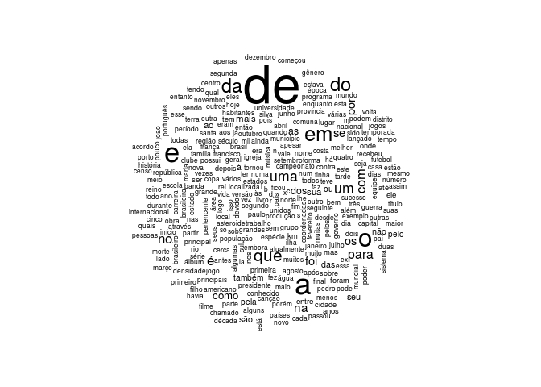

<!-- README.md is generated from README.Rmd. Please edit that file -->
ptwikiwords
===========

> Words used in Portuguese Wikipedia

[](https://travis-ci.org/dfalbel/ptwikiwords) [](https://cran.r-project.org/package=ptwikiwords)

This data-package contains a dataset with words used in a random sample from ~15.000 pages from the [Portuguese Wikipedia](https://pt.wikipedia.org/).

Installing
==========

It can be installed using:

``` r
devtools::install_github("dfalbel/ptwikiwords")
```

Using
=====

After installing the package, you can load the dataset using:

``` r
library(ptwikiwords)
data(ptwikiwords)
head(ptwikiwords)
#> # A tibble: 6 × 3
#>    word  count check
#>   <chr>  <int> <lgl>
#> 1    de 210954  TRUE
#> 2     a 109652  TRUE
#> 3     e 100028  TRUE
#> 4     o  87839  TRUE
#> 5    em  67040  TRUE
#> 6    do  59489  TRUE
```

The dataset contains 3 columns:

-   word: word, as is, found in Wikipedia pages
-   count: number of times the word was found in the sample of Wikipedia pages
-   check: wheter the word exists in the portuguese language

Here is a wordcloud of those words:

``` r
suppressPackageStartupMessages(library(dplyr))
suppressPackageStartupMessages(library(wordcloud))
words_filter <- ptwikiwords %>%
  filter(check == T) %>%
  slice(1:300)
wordcloud(words_filter$word, words_filter$count)
```


